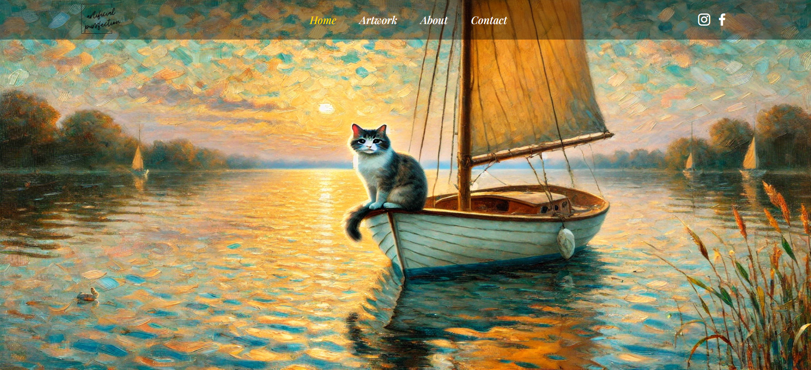

# Welcome to Artificial Purrfection

Artificial Purrfection is a responsive website where AI-generated art meets feline charm to create a fictional art portfolio! This project was created by Cecelia Braswell, a web developer with a passion for two things— cats and coding.

Each piece of art featured here is the result of prompts provided to ChatGPT, generating unique depictions of cats in a variety of artistic styles. From the dreamlike landscapes of Surrealism to the bold energy of Pop Art, the delicate elegance of Art Nouveau, and the expressive brushstrokes of Impressionism, every image showcases how AI can breathe life into creativity.

Beyond the art itself, Artificial Purrfection is a testament to the power of technology and imagination. This platform isn’t just a portfolio— it’s a continuous learning journey, where I explore new ways to enhance and grow my web development skills.

## Built with

## How to get the most out of this project?

    Check it out the page <a href="https://ceceliabraswell.github.io/artificial-purrfection/">here</a>!

